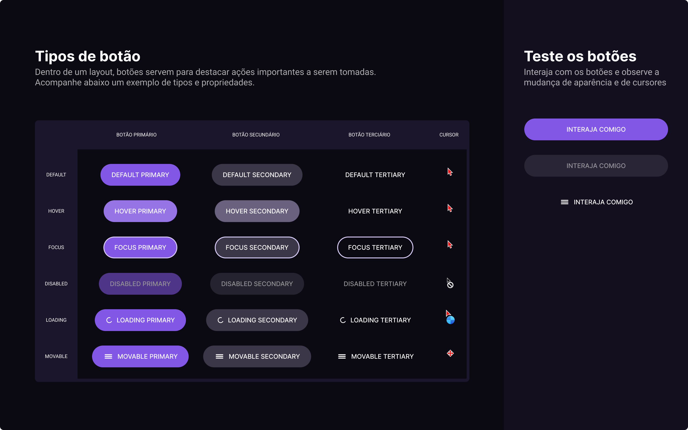

<h1 align="center"> Botões e Cursores </h1>

Terceiro desafio co boraCodar abrindo a mente sobre os cursores e botões em seus possíveis estados.</a> 

 

  <a href="#-tecnologias">Tecnologias</a>&nbsp;&nbsp;&nbsp;|&nbsp;&nbsp;&nbsp;
  <a href="#-status">Status</a>&nbsp;&nbsp;&nbsp;|&nbsp;&nbsp;&nbsp;
  <a href="#-projeto">Projeto</a>&nbsp;&nbsp;&nbsp;|&nbsp;&nbsp;&nbsp;
  <a href="#-layout">Layout</a>&nbsp;&nbsp;&nbsp;|&nbsp;&nbsp;&nbsp;
  <a href="#-licença">Licença</a>&nbsp;&nbsp;&nbsp;|&nbsp;&nbsp;&nbsp;
  <a href="#-contato">Contato</a>

  

 

  

## 🚧 Status 

HTML & CSS pronto. Agora avançamos para o JavaScript ajustando os cursores e botões.

## 🚀 Tecnologias

Esse projeto foi desenvolvido com as seguintes tecnologias:

- HTML & CSS
- JavaScript
- Git e Github
- Figma

## 💻 Projeto

  Interagindo com botões e cursores em estados diferentes. Você pode acessar o projeto online através [desse link](https://vagner-jr.github.io/Button-Cursor/).

## 🔖 Layout

Você pode visualizar o layout do projeto através [desse link](https://www.figma.com/file/iG4rrGAR0k9ovp0UnHRfKr/%23boraCodar---Desafio-3-(Community)?node-id=1%3A133&t=4f995yEWYxANyRh5-0). É necessário ter conta no [Figma](https://figma.com) para acessá-lo.

## 📄 Licença

Esse projeto está sob a licença MIT.

---

<h2 align="center">📱Contato</h2> 

